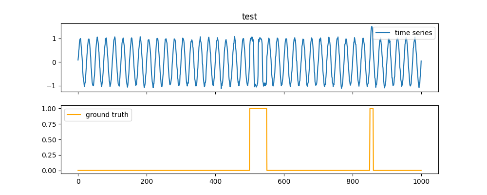

# GutenTAG


A good **T**imeseries **A**nomaly **G**enerator.

GutenTAG is an extensible tool to generate time series datasets with and without anomalies.
A GutenTAG time series consists of a single (univariate) or multiple (multivariate) channels containing a base osciallation with different anomalies at different positions and of different kinds.

## tl;dr

The following call uses the [`example-config.yaml`](generation_configs/example-config.yaml) configuration file to generate a single time series with two anomalies in the middle and the end of the series.

```bash
python -m gutenTAG --config-yaml generation_configs/example-config.yaml --seed 11 --no-save --plot
```



## Installation

```bash
# clone GutenTAG repository or extract the archive
git clone git@gitlab.hpi.de:akita/guten-tag.git #or unzip guten-tag.zip
cd guten-tag

# (optionally) create a new conda environment with Python 3
conda create -n gutentag python=3
conda activate gutentag

# install dependencies
pip install -r requirements.txt

# test installation
python -m gutenTAG
```

Test the installation with `python -m gutenTAG` and you should see the greeting and usage instructions:

```plain
$ python -m gutenTAG

                      Welcome to

       _____       _          _______       _____ _
      / ____|     | |        |__   __|/\   / ____| |
     | |  __ _   _| |_ ___ _ __ | |  /  \ | |  __| |
     | | |_ | | | | __/ _ \ '_ \| | / /\ \| | |_ | |
     | |__| | |_| | ||  __/ | | | |/ ____ \ |__| |_|
      \_____|\__,_|\__\___|_| |_|_/_/    \_\_____(_)

"Good day!" wishes your friendly Timeseries Anomaly Generator.


usage: __main__.py [-h] --config-yaml CONFIG_YAML [--output-dir OUTPUT_DIR] [--plot] [--no-save] [--seed SEED] [--addons [ADDONS ...]] [--n_jobs N_JOBS] [--only ONLY]
__main__.py: error: the following arguments are required: --config-yaml
```

## Usage

GutenTAG can be used as a python library and from the CLI.

### From CLI as program

Example call from CLI:

```bash
python -m gutenTAG --config-yaml generation_configs/example-config.yaml --plot --seed 42
# see help page with
python -m gutenTAG --help
```

See the [`example-config.yaml`-file](generation_configs/example-config.yaml) for an example of a configuration file.

### From within python as library

To generate GutenTAG time series from Python, you have multiple options. Either you write a `dict()` with the same schema as the configuration uses and call the following:

```python
from gutenTAG import GutenTAG

config = {
   "timeseries": [
      {
         "name": "test",
         "length": 100,
         "channels": 1,
         "base-oscillation": {"kind": "sinus"},
         "anomalies": [
            {"length": 5, "types": [{"kind": "mean"}]}
         ]
      }
   ]
}
generators, overview = GutenTAG.from_dict(config, plot=True)

# call generate() to create the datasets (in-memory)
for g in generators:
   g.generate()

# we only defined a single time series
assert len(generators) == 1
gen = generators[0]

# the data points are stored at
gen.timeseries
# the labels are stored at
gen.labels

# you can plot the results via
gen.plot()
```

Or you call the class and set its parameters yourself. However, this is not recommended!

## Structure

GutenTag generates time series based on two fundamental building blocks: base oscillations and anomalies.
Each time series has the following properties:

- optional name
- length
- number of channels
- a single base oscillation
- a list of anomalies (at different positions in the time series)

For a more detailled look at the structure of GutenTAG, please consider the [Wiki](https://gitlab.hpi.de/akita/guten-tag/-/wikis/home).

### Base Oscillations

The generator comes with the following base oscillations in [./gutenTAG/base_oscillations](./gutenTAG/base_oscillations):

- sinus
- random_walk
- cylinder_bell_funnel
- ecg
- polynomial
- random mode jump

Base oscillations can have an underlying trend.
This trend can be any of the above base oscillations.

Using the `variance` property, you can add noise to the base oscillation.
The general kind of base oscillation is always the same for all channels of a time series.
However, noise and other random parameters differ between channels.

### Anomalies

The generator comes with the following anomaly types in [./gutenTAG/anomalies/types](./gutenTAG/anomalies/types):

- amplitude
- extremum
- frequency
- mean
- pattern
- pattern_shift
- platform
- trend
- variance
- mode correlation

## Adding a new Anomaly Type

1. create a new Enum type for [`AnomalyKind`](gutenTAG/anomalies/types/kind.py) and adapt the `generate` method
2. [RECOMMENDED] create a new anomaly type class under [gutenTAG/anomalies/types](gutenTAG/anomalies/types)
    1. the new class should inherit from [`gutenTAG.anomalies.BaseAnomaly`](gutenTAG/anomalies/types/__init__.py)

## Status

The following table shows which anomalies and base oscillations can be combined and
which combinations GutenTAG does not supported.

- `x` = Combination allowed
- `-` = Combination not allowed

|                  | Sinus | Random Walk | CBF | ECG | Polynomial | Random Mode Jump |
|:-----------------|:-----:|:-----------:|:---:|:---:|:----------:|:----------------:|
| amplitude        |   x   |      x      |  x  |  x  |      -     |         -        |
| extremum         |   x   |      x      |  x  |  x  |      x     |         -        |
| frequency        |   x   |      -      |  -  |  x  |      -     |         -        |
| mean             |   x   |      x      |  x  |  x  |      x     |         -        |
| pattern          |   x   |      -      |  x  |  x  |      -     |         -        |
| pattern_shift    |   x   |      -      |  -  |  x  |      -     |         -        |
| platform         |   x   |      x      |  x  |  x  |      x     |         -        |
| trend            |   x   |      x      |  x  |  x  |      x     |         -        |
| variance         |   x   |      x      |  x  |  x  |      x     |         -        |
| mode_correlation |   -   |      -      |  -  |  -  |      -     |         x        |

## TODO

### Features

- [ ] trend anomaly bug

### Future (nice to have)

- [ ] noise as variance `Union[float, List[float]]` for each channel
- [ ] nicer plot for multivariate time series
